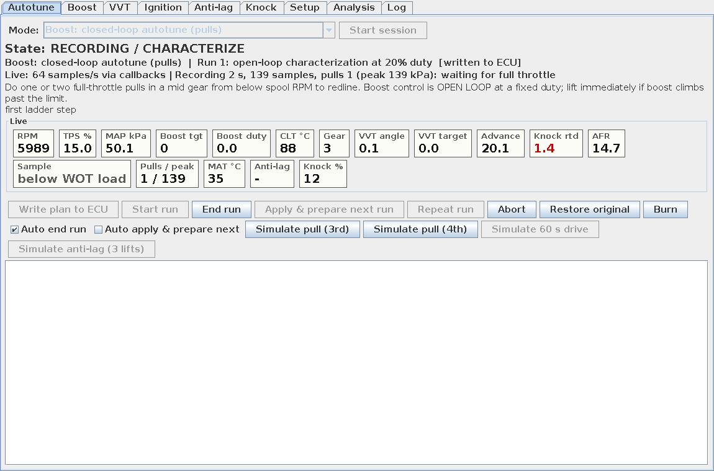
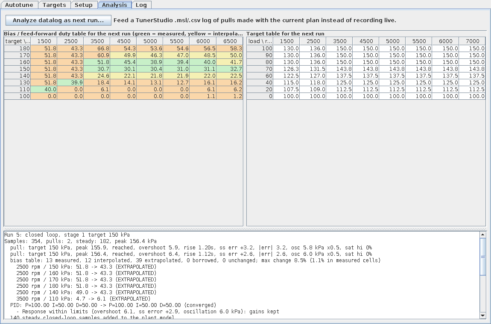
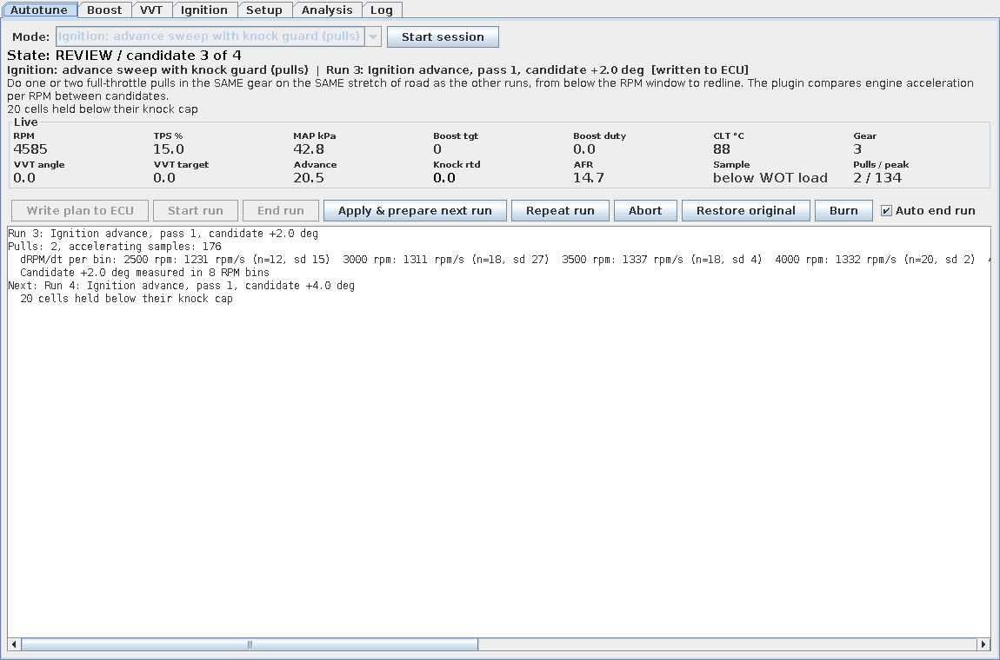
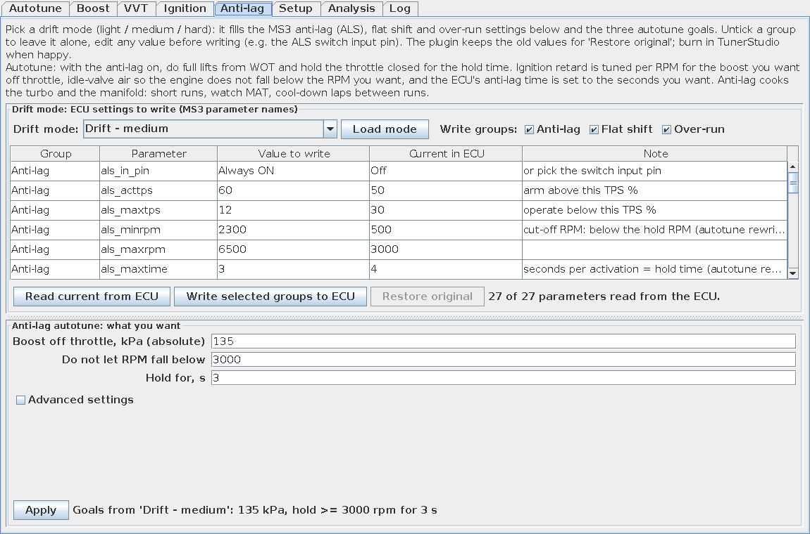
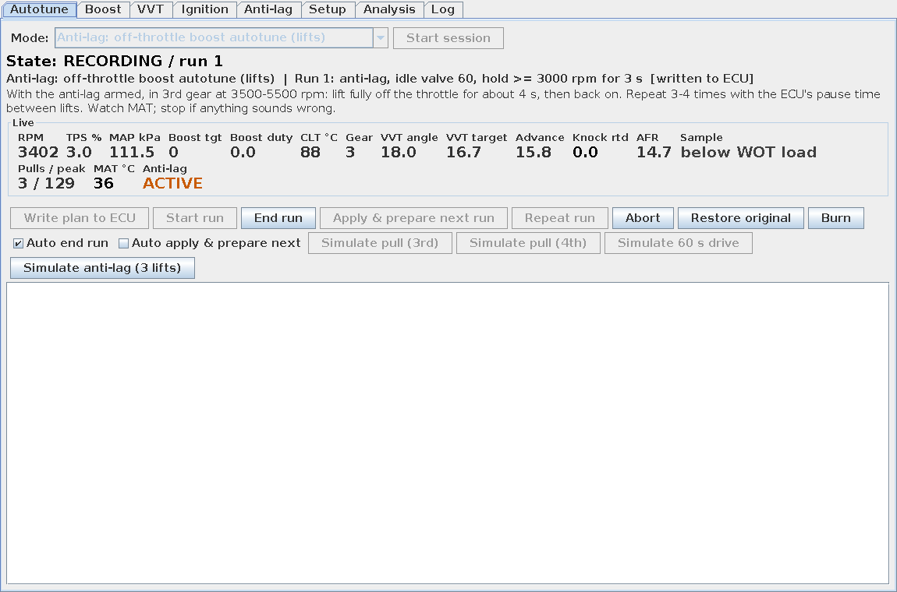
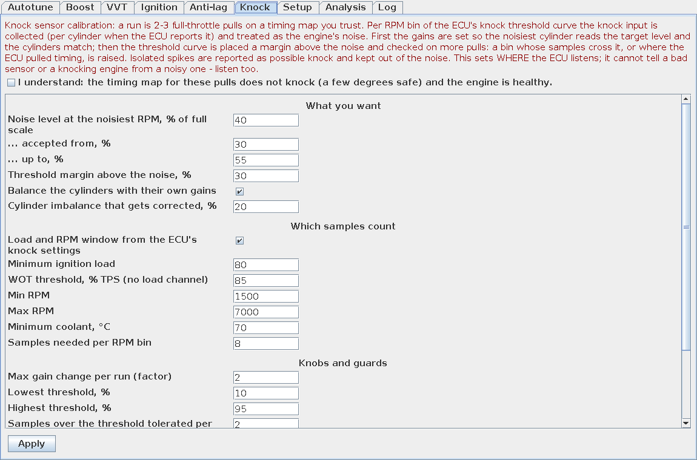

# Boost Autotune — плагин для TunerStudio

**[English version → README.en.md](README.en.md)**

Плагин для TunerStudio, который делает для буста то же, что VE Analyze делает для топливной карты:
вы задаёте желаемый целевой буст (один или несколько уровней), делаете несколько заездов, а плагин
сам характеризует систему «скважность → буст», заполняет bias-таблицу (стартовую скважность для
closed-loop), строит таблицу целей, подстраивает PID и проверяет сходимость.

Основная поддерживаемая прошивка — **MS3 / Stealth PCM (сигнатура `MS3 Format DM00.22f`)**, для
неё имена всех параметров и каналов уже прописаны в пресете. Есть пресеты для стандартного MS3 1.5+,
Speeduino и rusEFI (best effort: имена берутся из их INI, но их стоит проверить кнопкой *Validate*).

> ⚠️ **Безопасность.** Плагин пишет таблицы буста и PID-коэффициенты в ECU между заездами.
> Он никогда не выводит скважность в open-loop выше предсказанного лимита, а при превышении
> жёсткого лимита (`Hard limit`) немедленно переводит ECU в open-loop с минимальной скважностью и
> останавливает сессию. Тем не менее рука всегда должна быть на газу, а overboost-защита в ECU
> (`OverBoostKpa` у MS3) должна стоять выше `Hard limit` плагина и быть включена. Всё, что
> плагин меняет, можно откатить кнопкой **Restore original** (копия настроек буста снимается при
> старте сессии).



## Как это работает

1. **Характеризация в open-loop (2–3 заезда).** Плагин переключает ECU в open-loop, пишет в
   таблицу open-loop duty фиксированную скважность (по умолчанию 20 %, затем +15 % за заезд) и
   по установившимся участкам заезда строит модель «скважность → буст» для каждого столбца RPM.
   Следующая ступень выбирается так, чтобы предсказанный буст не превысил `Hard limit − Prediction
   margin`; лестница заканчивается, когда наблюдаемый буст перекрыл самую высокую цель с запасом.
2. **Bias-таблица.** Из модели для каждой ячейки (RPM × целевой буст) вычисляется минимальная
   скважность, дающая этот буст (на «полке», где турбина больше не дует, берётся колено кривой).
   Столбцы без данных заимствуют у соседних.
3. **Closed-loop по ступеням.** Плагин строит таблицу целей для первой ступени (с рампой от
   давления пружины вейстгейта в зоне раскрутки), включает closed-loop (для MS3 —
   `boost_ctl_settings_cl = Closed-loop`, `boost_ctl_flags = Advanced Mode`,
   `boost_ctl_settings_on = On`) и мягко стартует PID (I и D вдвое меньше). После каждого заезда:
   * измеряет перерегулирование, время выхода, статическую ошибку и колебания;
   * правит P/I/D относительными шагами (масштаб коэффициентов прошивки не важен);
   * дообучает bias-таблицу установившимися точками closed-loop (с учётом задержки клапан→MAP);
   * при перерегулировании «одним горбом» на раскрутке (это не PID, а слишком сильная
     feed-forward) снижает bias около тех оборотов, где был пик («spool trim»);
   * снижает цели там, где клапан упёрся в максимум, а буст не достигнут.
   Ступень считается сошедшейся после двух подряд «хороших» заездов, затем плагин переходит к
   следующей цели. В симуляторе (тест `AutotuneEndToEndTest`) полный цикл 150 → 170 кПа занимает
   9 заездов с классической рампой и 14 с быстрым спулом (см. ниже): 3 характеризации, по 2–3 на
   ступень и до 4 «толчков» спула на последней.
4. **Максимально быстрый спул до цели** (галочка *Fastest spool to target* на вкладке Boost,
   включена по умолчанию). Обычная рампа целей в зоне раскрутки заставляет closed-loop приоткрывать
   вейстгейт раньше времени, а PID у MS3 работает только в окне `boost_ctl_lowerlimit` под целью —
   ниже окна скважность берётся из bias-таблицы как есть. Поэтому плагин:
   * держит клапан закрытым (максимальная скважность в bias-таблице) во всех ячейках, где цель
     недостижима: по модели нужно ≥ 90 % скважности или буст с закрытым клапаном в этом столбце
     измерен ниже цели;
   * пишет плоскую цель ступени сразу выше `Spool start RPM` (ниже — давление пружины), без рампы:
     под окном PID нет накопления интеграла, а ячейки, которые турбина не тянет, опустит триммер
     целей;
   * учится по каждому заезду, **на каких оборотах и через сколько секунд после газа** достигнута
     цель, и когда петля уже устоялась (PID сошёлся, bias не меняется, перерегулирование в норме),
     тратит до 4 заездов на «толчки» по очереди: ослабить spool trim → добавить feed-forward в
     столбцах, где цель достигается → поднять P → расширить окно closed-loop. Толчок оставляют,
     если цель пришла хотя бы на 50 об/мин раньше без перерегулирования выше лимита; толчок,
     давший перерегулирование, откатывается, и ручка закрывается;
   * если «горб» на раскрутке держится, несмотря на глубокий spool trim, добавляет упреждение — D
     вверх, I вниз — и сужает окно closed-loop (нужна привязка `boost_ctl_lowerlimit` в Setup).
   В отчёте заезда: `Spool: target reached at 3383 rpm, 1.2 s after WOT (best this stage …)`,
   для сравнения — где цель достигалась в open-loop на верхней ступени лестницы. В симуляторе
   170 кПа достигаются примерно на 230 об/мин раньше, чем с рампой.



Заезд («run») — это один-два прострела в полный газ в средней передаче от оборотов ниже раскрутки
до отсечки. Плагин отбирает только установившиеся точки: WOT, прогретый мотор, окно RPM, нет
boost cut, MAP и скважность не меняются быстро, и т.д. — те же фильтры, что и у VE Analyze.

## Режимы VVT и зажигания

Помимо буста плагин умеет ещё три вещи (переключатель **Mode** на вкладке Autotune):

* **VVT: closed-loop PID (обычная езда).** Заезд здесь — просто минута-две обычной езды с
  разными нагрузками и оборотами. Плагин сравнивает `vvt_ang1` с `vvt_target1`: точность на
  участках, где цель стоит на месте, звон (быстрые повторяющиеся качания) и запаздывание (сдвиг
  по времени, при котором угол лучше всего совпадает с целью, — кросс-корреляция). Правила:
  звон → P вниз (и немного I вниз, D вверх), запаздывание → P вверх, постоянное смещение → I
  вверх, остаточная ошибка с «покачиванием» → P чуть вниз. Готово после двух хороших прогонов.
  Коэффициенты: `vvt_ctl_Kp/Ki/Kd`.
* **VVT: cam target sweep (заезды).** Оптимизация WOT-строк таблицы `vvt_timing1`. К текущим
  значениям строк с нагрузкой ≥ `min load` по очереди прибавляются смещения (по умолчанию
  `0, −10, −5, +5, +10` °), один вариант — один заезд (1–2 прострела **в той же передаче на том же
  участке дороги**). Прокси момента — ускорение двигателя dRPM/dt по бинам оборотов (в одной
  передаче оно пропорционально моменту; сравнение вариантов в одном бине сокращает инерцию и
  сопротивление). Для каждого бина выбирается лучший вариант, если выигрыш больше `min gain` и
  больше шума измерения; результат сглаживается по оборотам и пишется только в WOT-строки.
* **Ignition: advance sweep with knock guard (заезды).** То же для WOT-строк `advanceTable1`
  (по умолчанию смещения `0, −2, +2, +4` °, два прохода — второй в обратном порядке, чтобы
  скомпенсировать дрейф условий). Выбор по **правилу MBT**: минимальное опережение, момент при
  котором в пределах `MBT plateau` (0.5 %) от лучшего. Защиты:
  * любой `knockRetard` ≥ 0.5 ° от штатного knock-контроля ECU ставит ячейке «потолок» на
    2 ° ниже опережения, при котором детонировало; в дальнейшем ячейка выше потолка не
    поднимается никогда (в т.ч. в базовом варианте — это даёт и обучение «убрать угол там, где
    стучит»);
  * `knockRetard` ≥ 3 ° (сильная детонация) или AFR беднее 13.0 на WOT — немедленный останов и
    возврат исходной таблицы;
  * ни одна ячейка не поднимается больше чем на `+4 °` относительно исходной за сессию, плюс
    абсолютный лимит;
  * чекбокс подтверждения на вкладке Ignition обязателен.

  

  **Это не замена стенду и ушам.** Прокси по ускорению на дороге шумный (разница +2 ° около MBT —
  это ~1 % момента), поэтому по умолчанию требуются два прохода и выигрыш выше шума; плагин
  скорее «подтянет явно недокрученные ячейки и уберёт угол там, где стучит», чем найдёт точный
  MBT. Работает только если в ECU включён knock-контроль (у вас — `knk_option = Safe Mode`,
  внутренний модуль) и есть широкополосник.

Во всех режимах есть *Restore original* (копия таблицы/коэффициентов снимается при старте),
анализ готового лога (`Analyze datalog…`) и демо-кнопки в симуляторе (*Simulate pull*,
*Simulate 60 s drive*, *Simulate anti-lag*).

Имена для Stealth PCM (пресет заполняет сам): VVT — `vvt_timing1` / `vvt_timing_rpm` /
`vvt_timing_load` (Y = `fuelload`), каналы `vvt_ang1`, `vvt_target1`, PID `vvt_ctl_Kp/Ki/Kd`;
зажигание — `advanceTable1` / `srpm_table1` / `smap_table1` (Y = `ignload`), каналы `advance`,
`knockRetard`, `knock`, `afr1`.

## Антилаг и режим дрифт

Вкладка **Anti-lag** — выбор режима дрифта, три цели автотюна и (по желанию) дополнительные
настройки.



### Режимы дрифта: лёгкий, средний, жёсткий

Режим (*Drift mode*) заполняет сразу две вещи: таблицу параметров MS3, которые уходят в ECU по
кнопке *Write selected groups to ECU*, и три цели автотюна. Старые значения запоминаются для
*Restore original*; после проверки — Burn в TunerStudio. Три группы параметров, каждую можно
отключить галочкой, любое значение можно поправить прямо в таблице до записи (например, вместо
`Always ON` выбрать пин переключателя антилага):

| | Лёгкий | Средний | Жёсткий |
|---|---|---|---|
| Буст на закрытом газе / удержание оборотов / секунд | 120 кПа / 2500 / 2 с | 135 кПа / 3000 / 3 с | 150 кПа / 3500 / 5 с |
| `als_maxtps` (работа ниже, % TPS) / `als_maxrpm` | 10 / 6000 | 12 / 6500 | 15 / 7000 |
| `als_pausetime` между включениями / `als_maxmat_C` | 4 с / 60 °C | 3 с / 65 °C | 2 с / 75 °C |
| `als_timing` (вся таблица) / `als_addfuel` / `als_sparkcut` | −12° / 10 % / 25 % | −16° / 15 % / 30 % | −22° / 25 % / 50 % |
| `als_iac_steps` (воздух РХХ, стартовое) / на DBW `als_iac_pos`, % дросселя | 90 / 6 % | 100 / 8 % | 140 / 12 % |
| Flat shift: `flats_hrd` (взвод `flats_arm` 3500, `flats_deg` −5) | 6000 | 6500 | 7000 |

Общее для всех трёх: `als_in_pin = Always ON`, взвод выше `als_acttps` = 60 %, `als_minrpm` и
`als_maxtime` считаются из целей (их же потом пишет автотюн), `als_minclt_C`/`als_maxclt_C` =
70/105, циклический пропуск искры `als_opt_sc = On` (пропуск топлива выключен), воздух через РХХ
`als_opt_idle = On`, оси `als_rpms` = 2000…7000 и `als_tpss` = 0…20, `launch_opt_on =
Launch/Flatshift` + `launchlimopt = Spark Cut`, `OvrRunC = Off` (отсечка на сбросе газа мешает
антилагу). Пресет **Off (street)** возвращает `als_in_pin = Off`, `launch_opt_on = Off`,
`OvrRunC = On`. Параметров, которых нет в вашем INI, плагин не трогает.

### Автотюн антилага: три цели

* **Boost off throttle** — давление во впуске на закрытом газе, кПа абс. Ручка — запаздывание
  зажигания в столбцах `als_timing` по оборотам (строки с TPS ≤ 20): мало буста → больше
  запаздывания, много → меньше; шаг адаптивный (2° около цели, до 6° вдали). Упёрлись в предел
  запаздывания — плагин принимает то, что есть, и говорит об этом.
* **Do not let RPM fall below** — обороты, ниже которых антилаг не даёт мотору упасть на
  закрытом газе. Ручка — воздух: на **drive-by-wire** (`drivebywire_opt_on = On`, как у вас) это
  открытие дросселя во время антилага `als_iac_pos` в % TPS (шаг 2 %, до 20 %, INI позволяет
  25.5 %); без DBW — РХХ (`als_iac_steps` для шагового клапана, `als_iac_duty` для ШИМ). Плагин сам
  определяет вариант по ECU: обороты просели ниже — открыть больше; держатся сильно выше — чуть
  меньше (меньше продувки и тепла). На DBW плагин следит, чтобы `als_maxtps` («работать ниже TPS»)
  был не ниже открытия + 3 %, иначе антилаг сам себя выключит открытым дросселем. В ECU также
  пишется `als_minrpm` = удержание − 700 (отсечка антилага заведомо ниже удерживаемых оборотов).
* **Hold for, s** — сколько секунд одно включение держит буст и обороты; пишется в
  `als_maxtime`.

Всё остальное (допуски, границы, защиты, шаги) — под галочкой *Advanced settings*. Порядок:
загрузить режим → *Write selected groups to ECU* → *Apply* → на вкладке Autotune режим Anti-lag,
*Start session* → *Write plan to ECU* → *Start run* → заезд: полный газ выше `als_acttps`, затем
полный сброс газа примерно на «секунды удержания + 1», снова газ; 3–5 таких сбросов на прогон
→ *End run* → отчёт: буст и минимальные обороты по событиям, новые запаздывание и воздух →
*Apply & prepare next*. Готово после двух подряд прогонов, где и буст, и обороты в допуске.



Защиты: температура во впуске `mat` — предупреждение 70 °C (прогон не засчитывается), останов
80 °C с возвратом исходных настроек и `als_in_pin = Off`; защита от глохнущего мотора (обороты
ниже 1200 при активном антилаге), overboost 200 кПа, не больше 30 с активного антилага за прогон.
Активность антилага берётся из бита 128 канала `status10`; без него — по TPS ≤ 12 %.
В симуляторе сессия сходится за 5–8 прогонов (тесты `AlsSessionTest`,
`antilagSessionRetardsTimingToTheOffThrottleTarget`).

**Осторожно.** Антилаг сжигает турбину, коллектор и катализатор: короткие прогоны, круги
охлаждения между ними, исправный датчик температуры во впуске и система охлаждения обязательны.
Не для улицы.

## Калибровка датчиков детонации

Режим **Knock: sensor calibration** (вкладка **Knock**) настраивает сам вход детонации Stealth PCM:
усиление по цилиндрам `knock_gain01…06` и кривую порогов `knock_thresholds` по оборотам
`knock_rpms`. Идея: на карте зажигания, которая заведомо не стучит (на пару градусов безопаснее
рабочей), всё, что слышит датчик на полном газу, — механический шум мотора. Прогон — 2–3 прострела
в 3-й передаче через весь диапазон оборотов; плагин собирает уровень `knock` (и `knock_cyl01…06`,
когда `knock_conf_percyl = On`) по бинам `knock_rpms` при нагрузке ≥ `knk_minload` в окне
`knk_lorpm…knk_hirpm` (берутся из ECU) и считает по каждому бину медиану, 95-й перцентиль и
максимум.



Две фазы:

* **Survey — усиление.** Самый шумный бин/цилиндр приводится к целевому уровню 40 % шкалы
  (допуск 30…55 %): усиление × (цель / измеренное), не больше чем в 2 раза за прогон, до
  ближайшего значения из списка `$KNOCK_GAIN`. С поцилиндровыми каналами цилиндр, который тише
  самого громкого больше чем на 20 %, получает больше усиления — одна кривая порогов должна
  подходить всем шести. При смене усиления пороги масштабируются вместе с ним, чтобы защита не
  пропала. Забитый в 100 % вход (свежий MS3 с усилением 1.000) — обычный случай: за 1–2 прогона
  усиление уходит к 0.4–0.6.
* **Verify — пороги.** Когда усиление в допуске, порог каждого бина = p95 шума × 1.3 (и не ниже
  максимума + 3 пункта), неизмеренные бины — по соседям, кривая сглаживается, чтобы бин не
  проваливался под соседей. Дальше прострелы на проверку: бин, где обычные сэмплы пересекли порог
  (одна случайная точка прощается) или где ECU сработал knock retard, поднимается на 10 %; бин,
  где порог оказался далеко выше шума (> ×1.5), один раз подтягивается вниз. Готово после двух
  чистых прогонов подряд.

Одиночные всплески (> 1.35 × медианы + 3) считаются не шумом, а возможной детонацией: они не
входят в оценку шума, в отчёте помечаются, и если их в бине ≥ 3, порог там не поднимается, а
сессия пишет «похоже на настоящую детонацию — исправьте карту и повторите». Отчёт: таблица по
бинам (n, p50, p95, max, всплески, превышения, срабатывания retard, порог → новый), p95 по
цилиндрам с усилением. На вкладке Analysis — кривая порогов и усиления по цилиндрам до/после,
в строке Live — уровень `Knock %`. *Restore original* возвращает и усиление, и кривую. Настройки
(цель шума и допуск, запас порога, балансировка цилиндров, окно нагрузки/оборотов, шаги и защиты)
— на вкладке Knock; обязательна галочка «карта зажигания не стучит». Имена для Stealth PCM
(пресет заполняет сам): `knock_thresholds` / `knock_rpms`, `knock_gain` + номер, `knock_cyl` +
номер, `nCylinders`, `knock_conf_percyl`, `knk_option` (только чтение — предупреждение, если
`Disabled`), `knk_minload` / `knk_lorpm` / `knk_hirpm`. В симуляторе (6 цилиндров разной
громкости, усиление 1.000 на старте) сессия сходится за 4–5 прогонов (`KnockCalSessionTest`,
`knockCalibrationSetsTheGainsAndTheThresholdCurve`).

**Что это не делает.** Плагин не отличит неисправный датчик или стучащий мотор от шумного: он
ставит пороги туда, где шум, — слушайте мотор сами и калибруйте на карте, которой доверяете.
Частота (`knock_bpass`), окно (`knock_starts` / `knock_durations`) и интегратор не трогаются.

## Дашборды TunerStudio

В папке `dash/` три готовых дашборда для Stealth PCM (подпись прошивки берётся из вашего файла,
сейчас `MS3 Format DM00.23f`; для другой версии перегенерируйте — см. ниже). Загружаются в
TunerStudio: правый клик по дашборду → *Load Dashboard…* (или меню Dashboard) → выбрать файл.
Внешний вид (безель, стрелка, шрифт) взят из вашего дашборда, фон тёмный.

* **`track_boost.dash` — настройка по трассе.** Большие RPM, MAP и AFR; справа цифры: цель буста
  `boost_targ_1`, скважность `boostduty`, опережение, knock retard, CLT, MAT, EGT, давление масла и
  топлива, напряжение, угол VVT и цель. Во втором ряду циферблаты knock retard, EGT, давление масла
  и boost duty; линии TPS, MAP, цели буста и скважности. Внизу индикаторы лимитеров и защит:
  overboost, spark cut, fuel cut, soft limiter, knock, closed-loop буста, launch, flat shift, ALS,
  и ошибки (AFR/EGT shutdown, масло, давление топлива, датчик детонации, MAP, sync, need burn,
  config error).
* **`idle_injectors_throttle.dash` — холостой ход, форсунки, дроссель.** RPM в мелкой шкале
  0–4000, duty форсунок `dcseq1` и AFR большими; справа цель холостого `cl_idle_targ_rpm`, шаги и
  скважность РХХ, коррекция closed-loop холостого, ширина импульса, VE, EGO-коррекция, цель AFR,
  прогревное и ускорительное обогащение, dwell, напряжение. Второй ряд: EGO-коррекция, MAP, CLT,
  MAT; линии TPS, педали и цели дросселя (DBW), скорости TPS/MAP, барометр. Индикаторы: CL idle,
  idle VE/adv, idle-up, кондиционер, вентилятор, TPS/MAP accel и decel, ready/cranking/warmup,
  отсечка на сбросе газа, DBW, ошибки TPS/CLT, need burn.
* **`drift_antilag.dash` — дрифт и антилаг.** RPM, MAP и MAT большими (MAT с предупреждением
  65 °C и красной зоной 80 °C, как в автотюне антилага); справа EGT, угол зажигания (видно
  запаздывание ALS), цель и скважность буста, AFR, knock retard, CLT, давление масла и топлива,
  напряжение, шаги РХХ, передача. Второй ряд: EGT, зажигание, AFR, давление масла; линии TPS, MAP,
  MAT, EGT. Индикаторы: ALS ACTIVE, launch, flat shift, spark/fuel cut, overboost, soft limiter,
  knock; ошибки по температуре и давлению.

Индикаторы битов состояния используют каналы вида `status2AND64_OC`, которые TunerStudio создаёт
из индикаторов INI (`{ status2 & 64 }`); они есть в проекте с этой прошивкой. Перегенерация под
другую подпись или после правок раскладки:

```
python3 dash/generate_dashboards.py <любой ваш .dash с безелем и стрелкой> ["MS3 Format DM00.24f"]
```

## Установка

Требуется TunerStudio с поддержкой плагинов (TunerStudio MS 3.x; API плагинов 1.0).

1. Соберите или скачайте `BoostAutotune.jar` (см. ниже).
2. Положите его в папку плагинов TunerStudio:
   * `~/.efianalytics/TunerStudio/plugins/` (Linux/macOS) или
     `C:\Users\<вы>\.efianalytics\TunerStudio\plugins\` (Windows),
   * либо в папку `plugins` внутри каталога установки TunerStudio.
3. Перезапустите TunerStudio, откройте проект. Плагин появится в меню **Tools → Boost Autotune**.

Сборка из исходников (нужен JDK 8+ и Maven 3):

```bash
mvn -q verify
# результат: boost-autotune-plugin/target/BoostAutotune.jar
```

API TunerStudio (`TunerStudioPluginAPI.jar`) лежит в `repo/` как локальный Maven-репозиторий и в
итоговый jar не попадает (scope `provided`).

Попробовать без машины можно на встроенном симуляторе MS3:

```bash
java -cp boost-autotune-plugin/target/BoostAutotune.jar io.github.xadmiral.boostautotune.plugin.DemoLauncher
```

Там есть кнопки *Simulate pull (3rd/4th gear)* — они прогоняют смоделированный заезд через весь
плагин.

## Подготовка ECU (Stealth PCM / MS3)

В базовом проекте `jzx110-171-base-22-map` буст-контроль выключен, таблицы забиты значениями по
умолчанию. Перед первой сессией:

1. **Boost Control Settings** в TunerStudio: пин соленоида (`boost_ctl_pins`) и частота
   (`boost_ctl_settings_freq`) уже заданы; **Overboost Protection**: `OverBoostKpa` (210 кПа в
   базовом тюне) должен быть выше `Hard limit` плагина (по умолчанию 200) — плагин сам понизит свой
   лимит, если это не так.
2. **Оси таблиц.** Плагин не переписывает бины осей. Выставьте в TunerStudio оси RPM таблицы целей
   (`boost_ctl_loadtarg_rpm_bins`, в базе 200…4000) на рабочий диапазон, например
   `1500 2500 3500 4500 5000 5500 6000 7000`. Ось Y таблицы bias (`boost_ctl_cl_pwm_targboosts1`,
   100…180 кПа) должна покрывать ваши цели; ось RPM bias (`boost_ctl_cl_pwm_rpms1`) — тоже.
3. **Closed-loop lower limit delta** (`boost_ctl_lowerlimit`) — оставьте штатное значение
   (100 кПа в базе слишком много: PID включится сразу; разумно 20–40 кПа). `Enable Boost when TPS
   more` (`boost_ctl_cl_tps_thresh`) — 100 % в базовом тюне; поставьте 80–90 %, иначе closed-loop
   будет ждать ровно 100 % TPS.
4. Прогрейте мотор: точки с `coolant` ниже `Minimum coolant` (70 °C) игнорируются.

## Работа с плагином

Вкладки:

* **Setup** — конфигурация ECU и привязка каналов/параметров. *Auto-detect* выбирает пресет по
  сигнатуре и уточняет оси таблиц из определений INI (через `UiSettingServer`). *Validate*
  проверяет, что каждое имя существует в прошивке. *Read tables* показывает таблицы так, как их
  понял плагин — сравните с редакторами TunerStudio; если строки и столбцы поменяны местами,
  измените *Table orientation* (TunerStudio API не документирует ориентацию `double[][]`, для
  квадратных 8×8 таблиц плагин по умолчанию считает строки осью Y).
* **Targets** — ступени целей (например `150, 170`), давление пружины, зона раскрутки, WOT-порог,
  жёсткий лимит, настройки характеризации и допуски closed-loop. *Preview target table* строит
  таблицу целей первой ступени по осям из ECU.
* **Autotune** — кокпит: состояние, план следующего заезда, инструкция водителю, живые значения,
  кнопки. Живые значения идут с момента открытия плагина, сессия для этого не нужна: плагин
  подписывается на каналы привязки сразу, а если TunerStudio не присылает обновления в течение
  секунды, читает каналы сам опросом (20 Гц). Жирная строка прогресса под планом говорит, что
  происходит: «Waiting for data from the ECU» (данных нет, проверьте связь и Setup → *Validate* /
  *Read live values*), «Live: 25 samples/s via callbacks, silent: gear» (какие каналы молчат),
  а во время записи — секунды, число сэмплов и заездов, пик буста и подсказка (ждём полный газ /
  в заезде, стабилизация / в заезде, обучение). В Log пишутся первые полученные данные, каждый
  засчитанный заезд и итог прогона; на Setup кнопка *Read live values* показывает текущее значение
  каждого привязанного канала прямо из TunerStudio.
  1. **Start session** — читает ECU, снимает копию для отката, строит первый план;
  2. **Write plan to ECU** — записывает таблицы/PID/режим в RAM ECU;
  3. **Start run** — начинает запись; сделайте 1–2 прострела;
  4. **End run** — анализ заезда и план следующего (или включите *Auto end run*: заезд
     закрывается сам через N секунд без WOT);
  5. **Apply & prepare next run** — принять план и записать его в ECU (или *Auto apply*);
  6. повторяйте до состояния **DONE**, затем **Burn**.
  *Repeat run* — переиграть тот же план, *Abort* — остановить, *Restore original* — вернуть
  исходные настройки буста.
* **Analysis** — bias-таблица следующего заезда с раскраской по качеству оценки (измерено /
  интерполировано / экстраполировано / заимствовано), таблица целей с подсветкой изменений,
  модель «скважность → буст», PID до/после, spool trim. Кнопка *Analyze datalog as next run…*
  прогоняет через сессию готовый лог TunerStudio (`.msl`/`.csv`) вместо живой записи — удобно,
  если заезды писались без ноутбука.
* **Log** — журнал действий (сохраняется в файл).

Настройки хранятся в `~/.efianalytics/BoostAutotune/settings.properties`.

## Структура проекта

```
boost-autotune-core/    чистая логика без зависимостей от TunerStudio и Swing
  model/                Sample, Axis, Grid, PidGains
  config/               AutotuneConfig — все настройки
  learn/                фильтр точек, сегментация заездов, PlantModel, BiasTableBuilder,
                        TargetTableBuilder, StepResponseAnalyzer, PidTuner, DutyLadder, TargetTrimmer,
                        TorqueProxy (dRPM/dt по бинам оборотов)
  sweep/                SweepSession — перебор смещений для VVT/зажигания, KnockGuard, правило MBT
  vvt/                  VvtTrackingAnalyzer + VvtPidSession — оценка слежения и подстройка PID VVT
  als/                  AlsSession — автотюн антилага (таблица als_timing + воздух РХХ, защиты MAT/stall)
  knock/                KnockCalSession — калибровка входа детонации (усиление по цилиндрам, кривая порогов)
  session/              AutotuneSession — конечный автомат сессии, RunPlan / RunReport, EcuState
  sim/                  BoostPlant + SimEcu + PullSimulator — симулятор для тестов и демо
  log/                  MslLogReader — чтение логов TunerStudio
boost-autotune-plugin/  Swing UI и связка с TunerStudio
  ecu/                  EcuPort (интерфейс), TsEcuPort (TunerStudio API), SimEcuPort (демо),
                        EcuBinding + EcuPresets, EcuAdapter (ориентация таблиц, чтение/запись), LiveFeed
  mode/                 ModeDriver: BoostDriver / SweepDriver / VvtPidDriver / AntilagDriver / KnockCalDriver — режимы поверх ECU,
                        AntilagPresets — пресеты дрифта (ALS / flat shift / over-run)
  ui/                   Autotune / Boost / VVT / Ignition / Anti-lag / Knock / Setup / Analysis / Log
  BoostAutotunePlugin   точка входа (манифест: ApplicationPlugin)
  DemoLauncher          запуск UI с симулятором
repo/                   вендоренный TunerStudioPluginAPI.jar (только для компиляции)
dash/                   три дашборда TunerStudio (трасса, холостой ход / форсунки / дроссель, дрифт) и их генератор
```

Тесты: `mvn test` — юнит-тесты компонентов, сквозные тесты на симуляторе (буст, VVT-перебор,
перебор зажигания с knock-лимитом и абортами, PID VVT, антилаг с защитами MAT/stall, калибровка
датчиков детонации), интеграционные
тесты контроллера для всех режимов и headless-сборка UI.

## Ограничения и что проверить на реальной машине

* Ориентация `double[][]` в API TunerStudio для квадратных таблиц определяется настройкой — сверьте
  через *Read tables* перед первой сессией.
* Плагин не меняет оси таблиц буста/VVT/зажигания, частоту соленоида, лимит overboost и пин выхода
  (оси `als_rpms`/`als_tpss` пишет только дрифт-пресет).
* Модель антилага в симуляторе грубая (давление ≈ 90 кПа + 1.4 кПа/° запаздывания + воздух РХХ);
  на машине шаги и пределы по углу стоит начать консервативно и следить за MAT/EGT.
* Пресеты Speeduino и rusEFI собраны по их INI без проверки на железе. У Speeduino в open-loop
  скважность живёт в той же таблице, что и цели, поэтому характеризация для него отключена —
  обучение идёт только в closed-loop. У rusEFI нет отдельной bias-таблицы (open-loop таблица
  складывается с PID), поэтому там тюнится только PID и цели.
* Алгоритм проверен на симуляторе; реальные турбины ведут себя иначе, и допуски (перерегулирование
  8 кПа, ошибка 5 кПа) при необходимости стоит ослабить на вкладке Boost.
* Быстрый спул подводит настройку к границе допуска по перерегулированию (толчки останавливаются,
  когда оно появляется). Если хочется запаса — уменьшите *Overshoot limit* или число толчков,
  или снимите галочку *Fastest spool to target*, тогда работает классическая рампа.

Лицензия — MIT.
